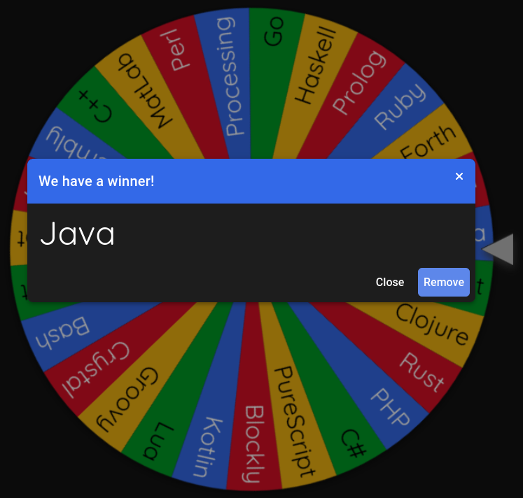

# Day 1: Trebuchet?!

Link: <https://adventofcode.com/2023/day/1>

## Language

## Writeup

Java was my first programming language, so this shouldn't be too hard. Unfortunately, I haven't written much Java since
version 8, so we'll see how outdated this one looks. _Fortunately_, that means I remember how to use Streams and we can
avoid the old buffered readers and manually iterating through lines. Thanks `java.nio`!

My first step is writing up the Makefile and figuring out how I want these Docker images to work. In this case, I'm
using the Eclipse Foundation's version of OpenJDK and running both `java` and `javac` in their container as necessary.
As is the plan with the rest of these days, run `make run_p1` or `make run_p2` to execute either part of today's
challenge.
