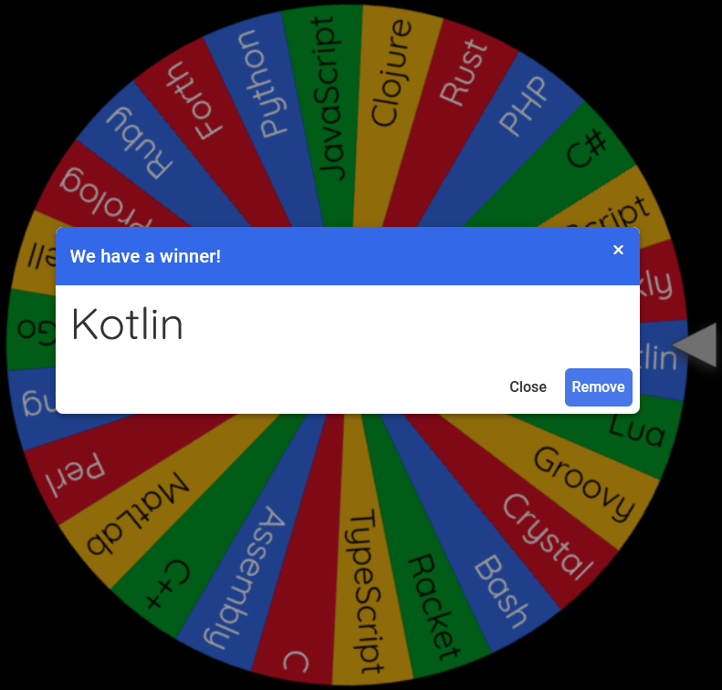

# Day 2: Cube Conundrum

Link: [https://adventofcode.com/2023/day/2](https://adventofcode.com/2023/day/2)

## Language

## Writeup

Looks like we're staying on the JVM today!

I wasn't able to find a handy Docker image with the Kotlin compiler ready to go, so I've made a quick `Dockerfile` for
this day, and a `docker-compose.yml` file to manage it. Running `make build` will automatically build the image if
necessary, and run the Kotlin compiler in the new image. Since Kotlin still just compiles down to a JAR file, we can
use the same JRE image from yesterday for actually running the program!
