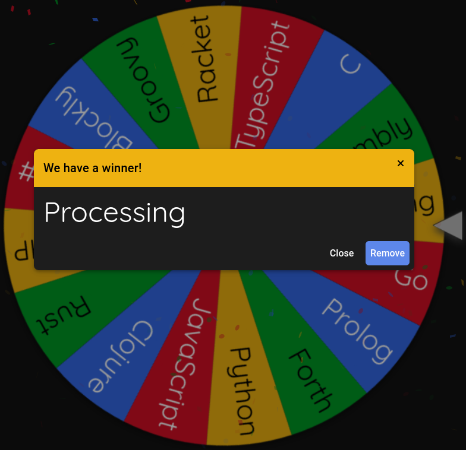

# Day 12: Hot Springs

Link: [https://adventofcode.com/2023/day/12](https://adventofcode.com/2023/day/12)

## Language

## Writeup

Okay, so Processing is basically just Java with some great builtins for simple graphics rendering. Unfortunately utilizing these rendering utilities would make it much harder to run this solution in a Docker continer. Therefore, this solution is really just dumb Java, with some imported Java just so I could do some multithreading.
